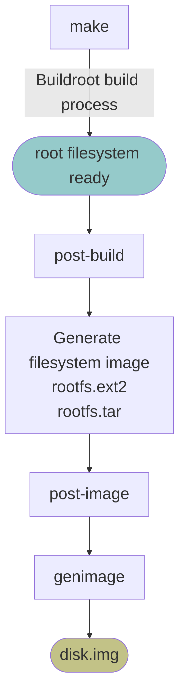

# Buildroot-Custom-Image-Generation

Documentation for understanding and customizing the Buildroot image generation pipeline.

Continue from [Buildroot-A-B-OTA-mechanisms-Demo](https://github.com/Jingyu1998/Buildroot-A-B-OTA-mechanisms-Demo/tree/main)

This repository introduces: 
* how Buildroot generates the final bootable OTA system disk image after Root Filesystem has already been built by Buildroot.
* how to customize each stage of the image generation pipeline.

## Image Generation Pipeline

## Documentation

The documents are organized from **Reference**, **Explanation**, **How-to guides**, making it easier to understand both the implementation details and the underlying mechanisms.

### Recommended Reading Order

If you are new to Buildroot image generation, read the documents in the following order:
1. Buildroot Custom Image Generation Pipeline
2. post-build mechanism and post-build script
3. post-image mechanism and post-image-efi script
4. genimage mechanism and genimage tool
5. How to customize the Buildroot Image Generation Pipeline

### Reference

Reference documents describing the purpose, inputs, outputs, and workflow of each component.

- [Buildroot Custom Image Generation Pipeline](doc/reference/Buildroot-Custom-Image-Generation-Pipeline.md)
- [post-build script](doc/reference/post-build-script.md)
- [post-image-efi script](doc/reference/post-image-efi-script.md)
- [genimage tool](doc/reference/genimage-tool.md)

### Explanation

Explains why each customization stage is needed for the OTA demo, what problem it solves.

Custom Root Filesystem
- [post-build mechanism](doc/explanation/post-build-mechanism.md)

Custom action after Root Filesystem Image has been created
- [post-image mechanism](doc/explanation/post-image-mechanism.md)

Custom partition with different Filesystem Images
- [genimage mechanism](doc/explanation/genimage-mechanism.md)

### How-to Guides

Step-by-step guides for running the Buildroot image generation process and checking the custom logs and output files.

- [How to customize the Buildroot Image Generation Pipeline](doc/how-to-guides/How-to-customize-the-Buildroot-Image-Generation-Pipeline.md)