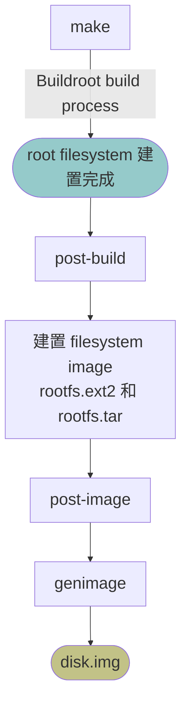

# Buildroot Custom Image Generation Pipeline

## 目的

在 Buildroot 既有的 disk image 建置流程中，加入專案所需要的客製化處理。

本專案的客製化處理主要透過三個機制
* post-build
* post-image
* genimage

## 先決條件

Buildroot 已完成 root filesystem 的建置。

root filesystem 建置完成代表 Buildroot 已將 root filesystem 所需檔案安裝至 `output/target`。

## 職責

* post-build: 
    * 執行 root filesystem 所需的客製化處理
    * 本專案新增 OTA version metadata、OTA update script、OTA boot check script
* 建置 filesystem image: 
    * `rootfs.ext2` 
    * `rootfs.tar`
* post-image:
    * 執行 image 所需的客製化處理
        * Buildroot 
            * 填入 UUID 到 `output/images` 底下的 `grub.cfg`
            * 填入 UUID 到 `output/images` 底下的 `genimage-efi.cfg`
        * 本專案
            * 新增 `grubenv` 到 `output/images` 底下
            * 以 `rootfs.tar` 產生 `rootfs_origin.tar` 和 `rootfs_update.tar`
            * 建置 `data.ext2` filesystem image 
* genimage: 
    * 建置 `efi-part.vfat` filesystem image
    * 建置 `disk.img`

## 流程圖

