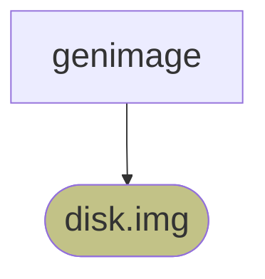

# genimage tool

## 目的

genimage 讀取 `genimage.cfg`，將 filesystem image 組裝成最終的 disk image。

## 職責

genimage 負責將已建立完成的 filesystem image，
依據設定檔組裝成最終的 disk image。

genimage 不負責建立 root filesystem，
root filesystem image 由 Buildroot 先前的流程產生。

## 執行時機

Image Generation Pipeline 的最後步驟



## rootpath 設計

genimage 原生設計會使用 `--rootpath`
指定 Root Filesystem 的來源目錄。

執行時，genimage 會將 rootpath 的內容複製到自己的暫存目錄，
作為建立 filesystem image 的來源。

但是在 Buildroot 建置流程中，
root filesystem image 已經由 Buildroot 完成建立，
並不需要 genimage 再次建立 root filesystem。

因此 Buildroot 不提供實際的 root filesystem 來源目錄，
而是使用 `mktemp -d` 建立空目錄，
作為 `--rootpath` 的參數以符合 genimage 命令格式。

## 命令

```bash
genimage \
	--rootpath "${ROOTPATH_TMP}"     \
	--tmppath "${GENIMAGE_TMP}"    \
	--inputpath "${BINARIES_DIR}"  \
	--outputpath "${BINARIES_DIR}" \
	--config "${GENIMAGE_CFG}"
```

### 選項

| 選項            | 用途                                           |
| -------------- | ---------------------------------------------- |
| `--rootpath`   | Root Filesystem 的來源目錄。                     |
| `--tmppath`    | genimage 工作時使用的暫存目錄，包含中間檔案與臨時資料。|
| `--inputpath`  | 輸入檔案所在目錄。                                |
| `--outputpath` | 產生映像檔的輸出目錄。                             |
| `--config`     | 指定 `genimage.cfg` 所在位址。                   |


### 引數

| 引數               | 引數展開                                   |
| ----------------- | ----------------------------------------- |
| `${ROOTPATH_TMP}` | `$(mktemp -d)`, eg: `/tmp/tmp.SWCX7xUhyF` |
| `${GENIMAGE_TMP}` | `output/build/genimage.tmp`               |
| `${BINARIES_DIR}` | `output/images`                           |
| `${GENIMAGE_CFG}` | `output/images/genimage-efi.cfg`          |

## 輸入

* `genimage-efi.cfg`
* filesystem image
    * `efi-part.vfat`
    * `rootfs.ext2`
    * `data.ext2`

## 輸出

`disk.img`

## 設定檔

描述 disk image 的 partition layout，
以及各 partition 使用的 filesystem image。

### Filesystem image mapping

| Filesystem image | partition |
| ---------------- | --------- |
| `efi-part.vfat`  | boot      |
| `rootfs.ext2`    | rootfsA   |
| `rootfs.ext2`    | rootfsB   |
| `data.ext2`      | data      |