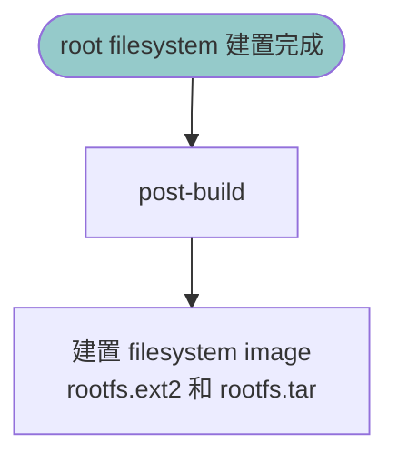

# post-build script

## 目的

在 root filesystem 建置完成後，
新增 OTA 專案所需的客製化內容。

## 職責

- 建立 OTA version metadata
- 加入 boot verification 腳本
- 加入 OTA install 腳本

## 執行時機
 
- root filesystem 建置完成後
- 建置 filesystem image 前

## 輸入

`output/target`: 即將打包成 root filesystem image 的目錄

## 輸出

修改 `output/target` ，加入以下 OTA 專案檔案：

- `/etc/ota-version`
- `/etc/init.d/S99ota-boot-check`
- `/root/install.sh`
