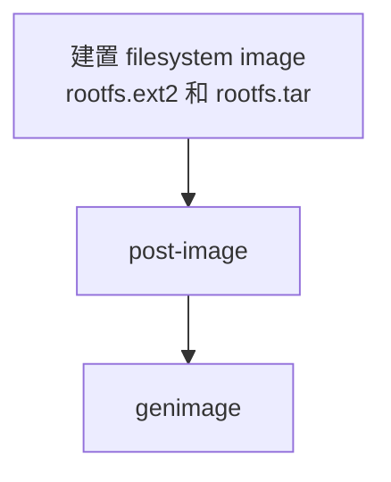

# post-image-efi script

## 目的

在 root filesystem image 建置完成後，產生 OTA 更新所需的額外 image。

此外，在執行 genimage 前，
準備 `grubenv` 以供建立 `efi-part.vfat`。

## 職責

- 建立 OTA restore package
- 建立 OTA update package
- 建立 data partition image
- 準備 genimage 所需檔案

## 執行時機

建置 filesystem image 後，
執行 genimage 前。

## 輸入

- `output/images/rootfs.tar`

## 輸出

- `output/images/rootfs_origin.tar`
- `output/images/rootfs_update.tar`
- `output/images/data.ext2`
- `output/images/efi-part/EFI/BOOT/grubenv`
